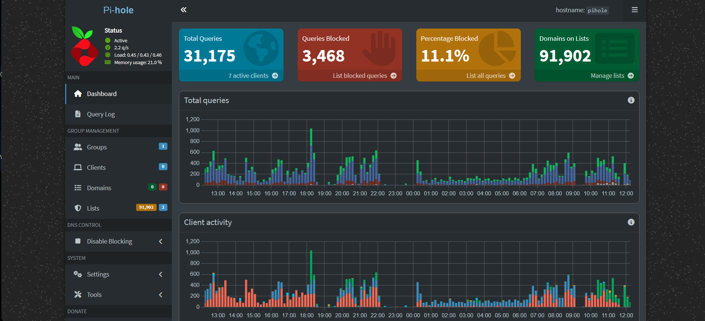
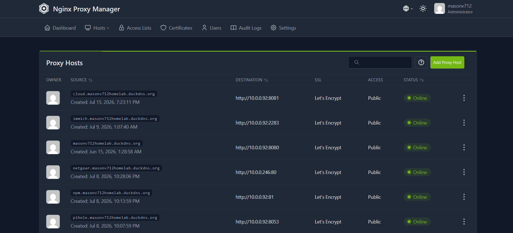
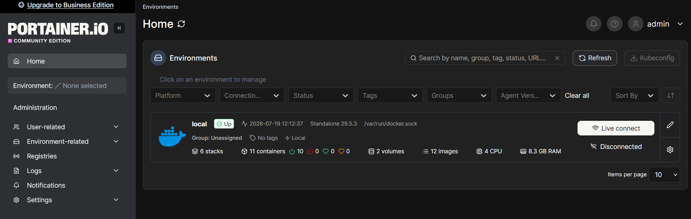
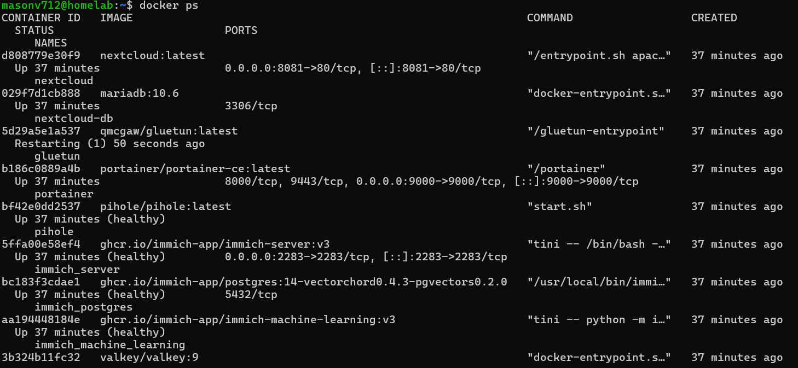
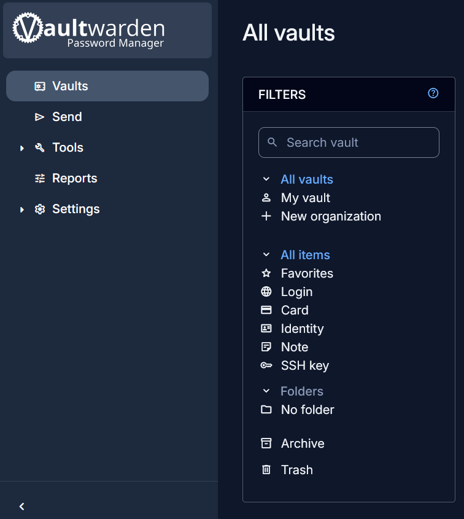
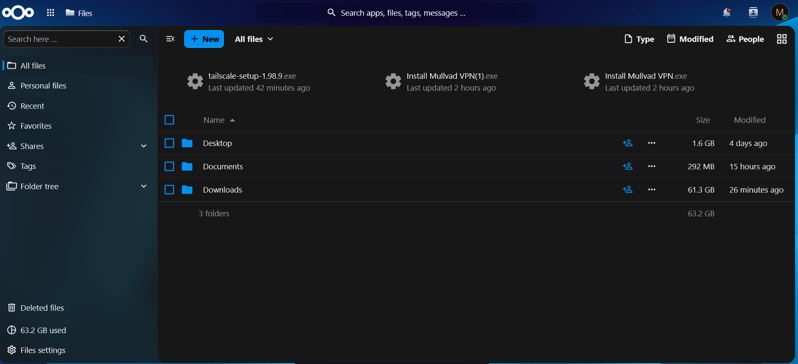
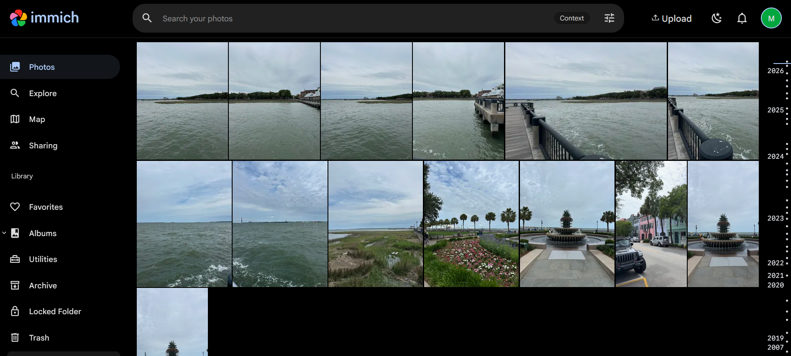
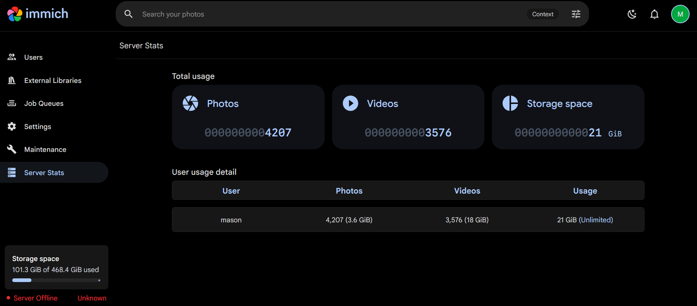
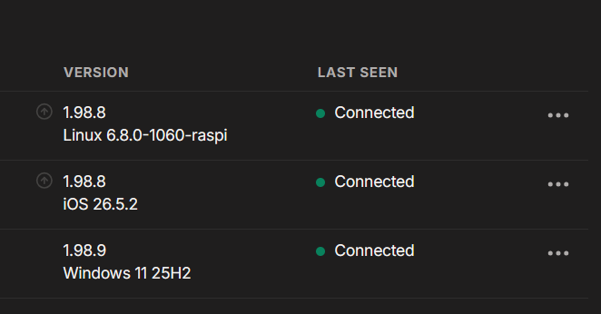
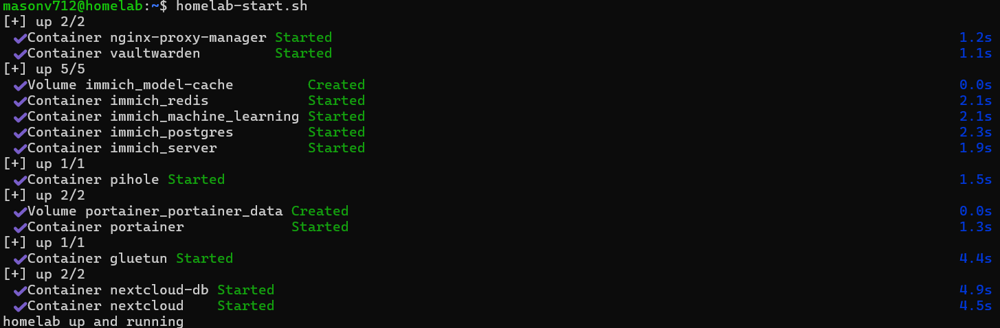

# Homelab Evidence Gallery

## Infrastructure & Services

### Pi-hole Dashboard

DNS-level ad blocking protecting the entire network (31k queries, 11.1% blocked).

### Nginx Proxy Manager

All internal services exposed securely through reverse proxy with automatic SSL certificates.

### Portainer Environment

Docker management interface showing 11 containers, 6 stacks, and 8.3GB RAM usage.

### All Containers Running

Every service (Vaultwarden, Immich, Nextcloud, gluetun, etc.) running and healthy.

## Services in Action

### Vaultwarden Password Manager

Self-hosted password manager storing all credentials encrypted locally.

### Nextcloud File Sync

63.2GB of synced documents and downloads actively stored and organized.

### Immich Photo Library

4,207 photos and 3,576 videos automatically organized and indexed for search.

### Immich Admin Dashboard

Real-world scale: 21GB storage, ML-indexed photos, full video support.

## Remote Access & Security

### Tailscale Connected Devices

3 devices (Linux Pi, iOS, Windows) securely connected via zero-trust VPN.

## Automation & Proof

### Startup Script in Action

LUKS unlock, storage mount, and all 11 containers starting automatically in ~30 seconds.

### Physical Setup

The actual hardware: TP-Link router, Netgear managed switch, Pi 5 with encrypted SSD.

---

**All images show real, working infrastructure** Everything runs 24/7.
